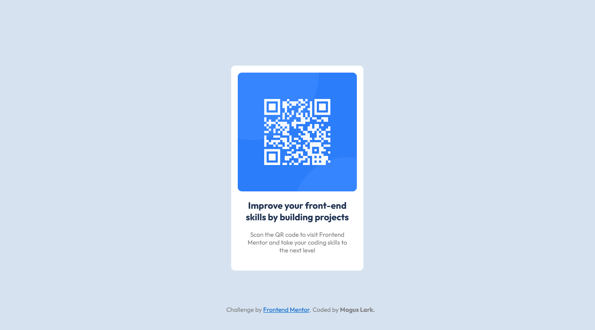

# Frontend Mentor - QR code component solution

This is a solution to the [QR code component challenge on Frontend Mentor](https://www.frontendmentor.io/challenges/qr-code-component-iux_sIO_H). Frontend Mentor challenges help you improve your coding skills by building realistic projects. 

## Table of contents
- [Screenshot](#screenshot)
- [My process](#my-process)
  - [Sites used](#sites-used)
  - [Built with](#built-with)
  - [Continued development](#continued-development)
  - [Useful resources](#useful-resources)
- [Author](#author)
- [Acknowledgments](#acknowledgments)

### Screenshot

## My process

1. Build HTML from scratch 
2. Recreate the sample image output in Figma
3. Trial and error design by CSS
4. After the desktop design, proceeded to mobile viewing CSS styling
 
- duration: (40 mins - first submission (static)) 
- unfortunately, I didn't time for this flexbox submission

## Sites used 
 - [Google Fonts](https://fonts.google.com/)
 - [Converting Colors](https://convertingcolors.com/)
 - [Codepen](https://codepen.io/)
 - [Codeply](https://www.codeply.com/)
 - [DevDocs](https://devdocs.io/)
 - [Figma](https://www.figma.com/)

## Built with

- Semantic HTML5 markup
- CSS custom properties
- CSS Flexbox layout

### Continued development
This may be not the final solution because I'm still learning more about HTML and CSS. I want to practise more on the CSS layout especially the use of Flexbox and Grid layout.

### Useful resources
- [Learn CSS layout](https://learnlayout.com/box-sizing.html) - This helped me review the basics of CSS positioning.
- [PX to REM converter](https://nekocalc.com/px-to-rem-converter) - Quick way to convert hardcoded unit pixels to responsive unit.

## Author

- Frontend Mentor - [@MagusLrk](https://www.frontendmentor.io/profile/MagusLrk)
- Twitter - [@dokibells34](https://www.twitter.com/dokibells34)

## Acknowledgments
I want to thank [@0xAbdulKhalid](https://www.frontendmentor.io/profile/0xAbdulKhalid) for reviewing this project. His suggestions reminded me to make my HTML semantic.
